# 🛍️ ECometa

<div align="center">


[](https://flutter.dev/)
[](https://dart.dev/)
[](LICENSE)
[](https://flutter.dev/)

</div>

A modern, feature-rich e-commerce mobile application built with Flutter, offering seamless shopping experiences with authentication, product browsing, Visual Searching and Filteration, cart management, and secure checkout.

## 📱 Screenshots / Demo

<div align="center">

### 🏠 **Home & Authentication**
<table>
  <tr>
    <td>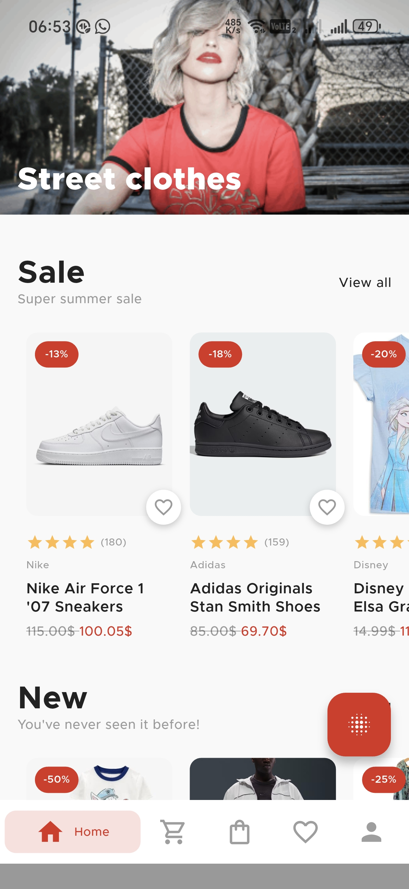<br/><b>Home Screen</b></td>
    <td>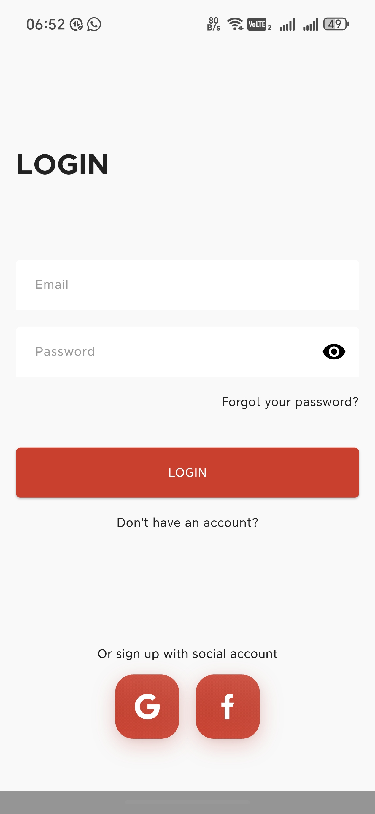<br/><b>Login</b></td>
    <td><br/><b>Register</b></td>
  </tr>
</table>

### 🛍️ **Shopping Experience**
<table>
  <tr>
    <td>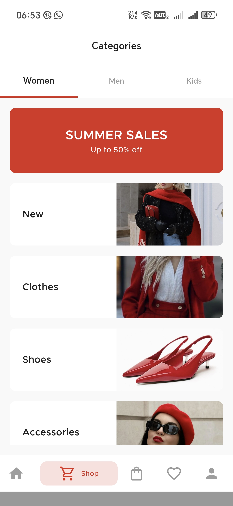<br/><b>Product Categories</b></td>
    <td>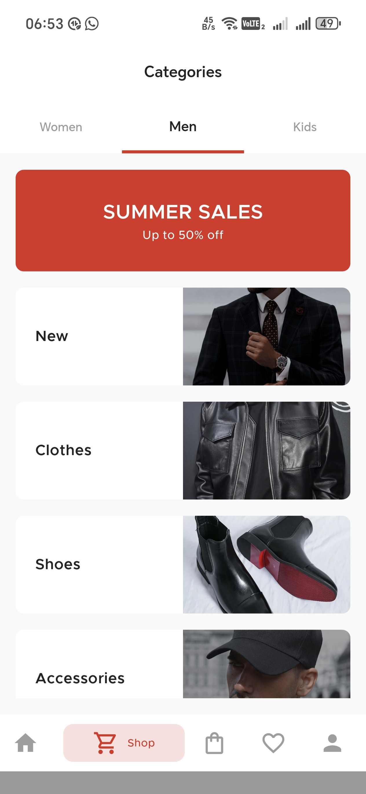<br/><b>Product Grid</b></td>
    <td>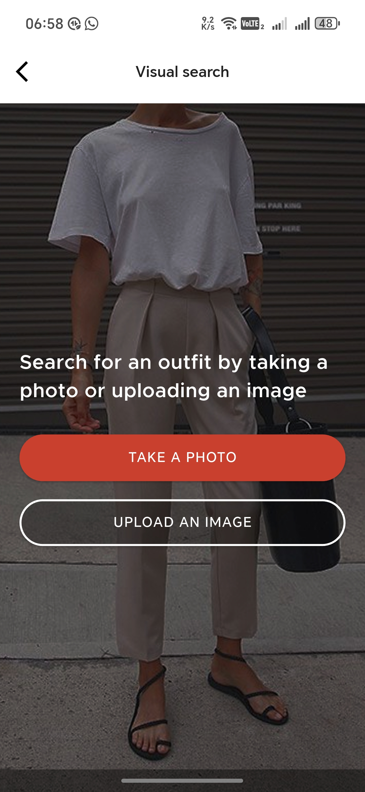<br/><b>AI Visual Search</b></td>
  </tr>
</table>

### 🛒 **Cart & Checkout**
<table>
  <tr>
    <td>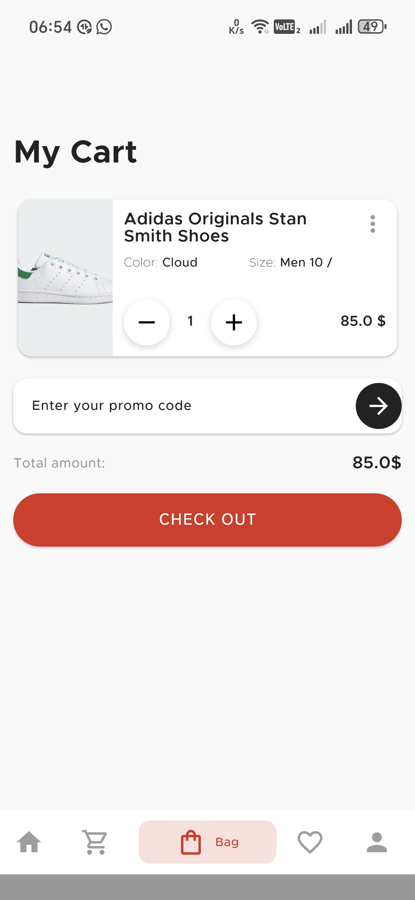<br/><b>Shopping Cart</b></td>
    <td>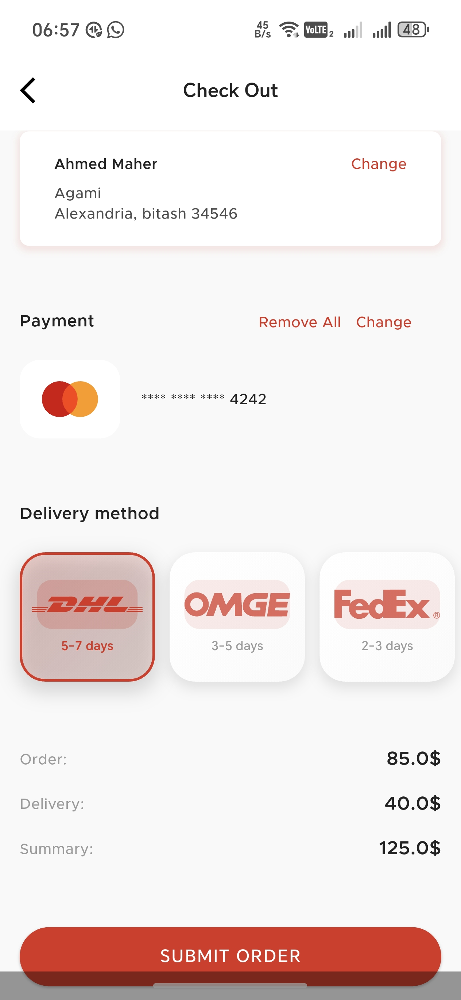<br/><b>Checkout Process</b></td>
    <td>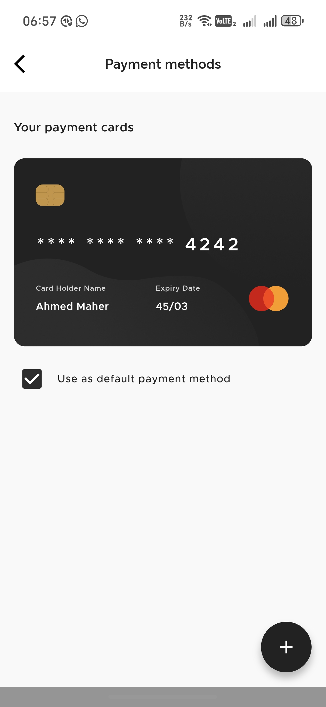<br/><b>Payment Options</b></td>
  </tr>
</table>

### 💳 **Payment & Orders**
<table>
  <tr>
    <td>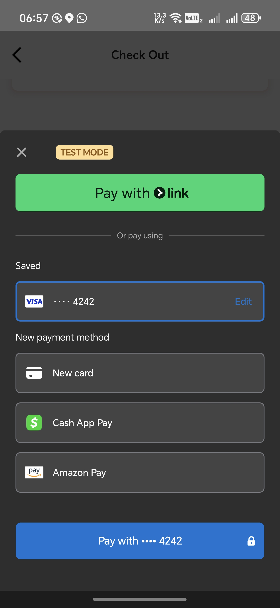<br/><b>Stripe Integration</b></td>
    <td>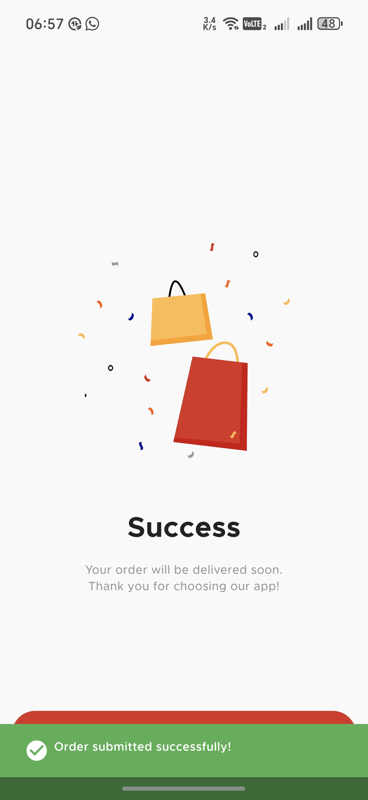<br/><b>Payment Success</b></td>
    <td>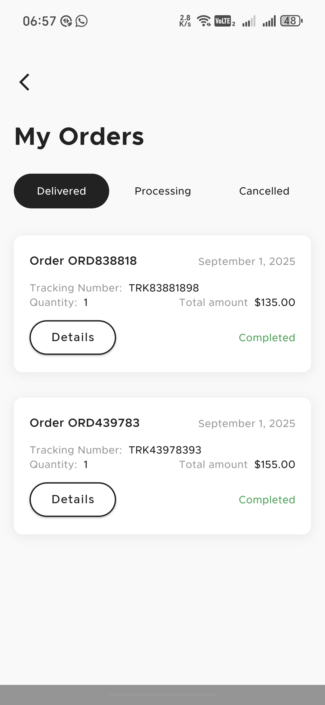<br/><b>Order History</b></td>
  </tr>
</table>

### 👤 **Profile & Settings**
<table>
  <tr>
    <td>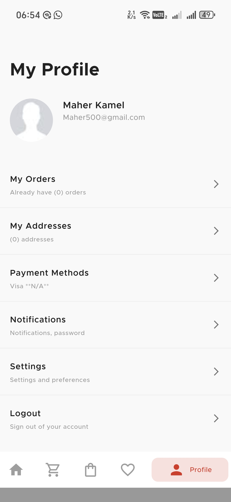<br/><b>User Profile</b></td>
    <td>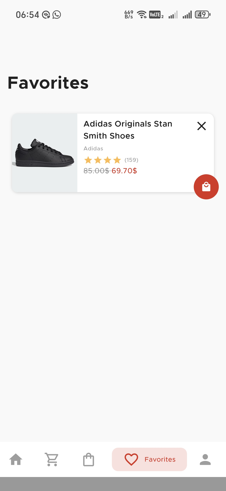<br/><b>Favorites & Wishlist</b></td>
    <td>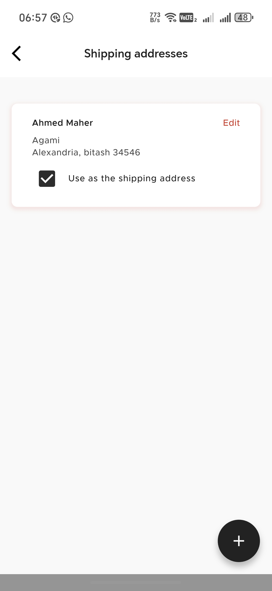<br/><b>Address Management</b></td>
  </tr>
</table>

### 🎥 Demo Video
<div align="center">
  <video width="300" controls>
    <source src="screenshots/video.mp4" type="video/mp4">
    Your browser does not support the video tag.
  </video>
  <br/>
  <i>📹 App Demo Video - Complete User Journey</i>
</div>

</div>

---

## 📋 Table of Contents

A modern, feature-rich e-commerce mobile application built with Flutter, offering seamless shopping experiences with authentication, product browsing, Visual Searching and Filtration, cart management, and secure checkout.

[](https://flutter.dev/)
[](https://dart.dev/)
[](LICENSE)
[](https://flutter.dev/)

## 📋 Table of Contents

- [Project Overview](#-project-overview)
- [Features](#-features)
- [Screenshots / Demo](#-screenshots--demo)
- [Installation & Setup](#-installation--setup)
- [Usage](#-usage)
- [Project Architecture](#-project-architecture)
- [Tech Stack](#-tech-stack)
- [Configuration / Environment Variables](#-configuration--environment-variables)
- [Contributing Guidelines](#-contributing-guidelines)
- [Testing](#-testing)
- [Roadmap / Future Improvements](#-roadmap--future-improvements)
- [Known Issues / Limitations](#-known-issues--limitations)
- [FAQ](#-faq)
- [License](#-license)
- [Acknowledgements / Credits](#-acknowledgements--credits)
- [Contact Info](#-contact-info)

## 🎯 Project Overview

This e-commerce application is designed to provide users with a comprehensive shopping experience. Built using Flutter's latest features and following clean architecture principles, the app offers a modern, responsive interface that works seamlessly across iOS and Android platforms.

**Target Audience:**
- Online shoppers looking for a smooth mobile shopping experience
- E-commerce businesses seeking a customizable mobile solution
- Developers interested in Flutter e-commerce implementations

**Key Benefits:**
- ⚡ Fast and responsive user interface
- 🔐 Secure authentication with multiple providers
- 🛒 Intuitive cart and checkout process
- 📱 Cross-platform compatibility
- 🎨 Modern, customizable design system

## ✨ Features

### 🔐 Authentication & User Management
- Email/password authentication
- Social login (Google, Facebook)
- User profile management

### 🏠 Home & Product Discovery
- Featured products carousel
- Category-based browsing
- New arrivals section

### 🔍 Search & Filtering
- Advanced product search
- **Visual search using Clarifai AI** - Search products by uploading images
- Category and brand filtering
- Price range selection
- Color and size filtering
- Sort by popularity, price, and date

### 🛒 Shopping Cart & Checkout
- Add/remove items from cart
- Quantity management
- Multiple shipping addresses
- Secure payment processing (Stripe integration via NestJS backend)

### ❤️ Favorites & Wishlist
- Save favorite products
- Quick add to favorites
- Favorites management

### 📝 Reviews & Ratings
- Product reviews and ratings
- Customer feedback system

### 👤 User Profile
- Order history tracking
- Personal information management
- Address book
- Account settings

### 🎨 UI/UX Features
- Responsive design
- Smooth animations
- Loading states and error handling
- Pagination
- **Cloud image optimization** via ImageKit.io for fast loading

##  Installation & Setup

### Prerequisites

- [Flutter SDK](https://flutter.dev/docs/get-started/install) (3.7.2 or higher)
- [Dart SDK](https://dart.dev/get-dart) (3.0 or higher)
- [Android Studio](https://developer.android.com/studio) or [VS Code](https://code.visualstudio.com/)
- [Git](https://git-scm.com/)

### Step-by-Step Setup

1. **Clone the repository**
   ```bash
   git clone git@github.com:Maheresio/ECometa.git
   cd ECometa
   ```

2. **Install dependencies**
   ```bash
   flutter pub get
   ```

3. **Set up environment variables**
   ```bash
   cp .env.example .env
   ```
   
   Edit `.env` file with your configuration:
   ```env
   STRIPE_PUBLISHABLE_KEY=your_stripe_publishable_key
   FIREBASE_API_KEY=your_firebase_api_key
   SUPABASE_URL=your_supabase_url
   SUPABASE_ANON_KEY=your_supabase_anon_key
   CLARIFAI_API_KEY=your_clarifai_api_key
   IMAGEKIT_PUBLIC_KEY=your_imagekit_public_key
   IMAGEKIT_PRIVATE_KEY=your_imagekit_private_key
   IMAGEKIT_URL_ENDPOINT=your_imagekit_url_endpoint
   NESTJS_API_URL=your_nestjs_backend_url
   ```

4. **Configure Firebase**
   - Create a Firebase project at [Firebase Console](https://console.firebase.google.com/)
   - Download `google-services.json` for Android and place it in `android/app/`
   - Download `GoogleService-Info.plist` for iOS and place it in `ios/Runner/`

5. **Configure Supabase**
   - Create a Supabase project at [Supabase](https://supabase.com/)
   - Update the Supabase URL and keys in your `.env` file

6. **Configure Clarifai**
   - Create a Clarifai account at [Clarifai](https://clarifai.com/)
   - Get your API key and add it to the `.env` file

7. **Configure ImageKit.io**
   - Create an ImageKit.io account at [ImageKit](https://imagekit.io/)
   - Get your public key, private key, and URL endpoint
   - Add them to the `.env` file

8. **Set up NestJS Backend**
   - Deploy your NestJS payment API
   - Update the `NESTJS_API_URL` in your `.env` file

9. **Run the application**
   ```bash
   flutter run
   ```

### Platform-Specific Setup

#### Android
```bash
flutter build apk --release
```

#### iOS
```bash
flutter build ios --release
```

#### Web
```bash
flutter build web --release
```

## 💻 Usage

### Running the App

1. **Development mode**
   ```bash
   flutter run
   ```

2. **Release mode**
   ```bash
   flutter run --release
   ```

3. **Hot reload during development**
   ```bash
   # Press 'r' in the terminal or 'R' for hot restart
   ```

### Key User Flows

1. **User Registration/Login**
   - Open the app
   - Tap "Sign Up" or "Login"
   - Use email/password or social login options

2. **Product Browsing**
   - Browse featured products on home screen
   - Use search functionality to find specific items
   - **Visual Search**: Upload product images to find similar items using Clarifai AI
   - Apply filters by category, price, brand, etc.

3. **Shopping Cart**
   - Tap "Add to Cart" on any product
   - View cart by tapping the cart icon
   - Modify quantities or remove items

4. **Checkout Process**
   - Review cart items
   - Add shipping address
   - Select payment method
   - Complete purchase via NestJS payment API

## 🏗️ Project Architecture

The project follows **Clean Architecture** principles with a feature-based folder structure:

```
lib/
├── core/                    # Shared utilities and configurations
│   ├── constants/          # API and app constants
│   ├── error/              # Error handling
│   ├── global/             # Global themes and configurations
│   ├── helpers/            # Helper functions and extensions
│   ├── network/            # Network layer (Dio client)
│   ├── responsive/         # Responsive design utilities
│   ├── routing/            # Navigation and routing
│   ├── services/           # Core services (Firebase, Supabase)
│   ├── usecase/            # Base use case classes
│   ├── utils/              # Utility classes
│   ├── value_objects/      # Value objects
│   └── widgets/            # Shared widgets
├── features/               # Feature modules
│   ├── auth/               # Authentication feature
│   ├── cart/               # Shopping cart feature
│   ├── checkout/           # Checkout process
│   ├── favorite/           # Favorites/wishlist
│   ├── home/               # Home screen
│   ├── profile/            # User profile
│   ├── review/             # Product reviews
│   ├── search/             # Search functionality by images
│   └── shop/               # Product browsing
└── main.dart              # App entry point
```

### Key Architectural Patterns

- **Clean Architecture**: Separation of concerns with data, domain, and presentation layers
- **BLoC Pattern**: State management using flutter_bloc
- **Dependency Injection**: Using get_it for service locator
- **Repository Pattern**: Data access abstraction
- **Use Case Pattern**: Business logic encapsulation

## 🛠️ Tech Stack

### Core Framework
- **Flutter** (3.7.2+) - Cross-platform UI framework
- **Dart** (3.0+) - Programming language

### State Management
- **flutter_bloc** - BLoC pattern implementation
- **flutter_riverpod** - State management solution
- **hooks_riverpod** - Riverpod with Flutter hooks

### Backend & Database
- **Firebase** - Authentication and real-time database
- **Supabase** - Backend-as-a-Service
- **Cloud Firestore** - NoSQL cloud database for product storage
- **NestJS** - Backend API for payment processing
- **NestJs** - Payment Apis

### UI/UX Libraries
- **flutter_screenutil** - Responsive design
- **google_fonts** - Typography
- **flutter_svg** - SVG support
- **lottie** - Animation support
- **shimmer** - Loading animations
- **cached_network_image** - Image caching

### AI & Image Processing
- **Clarifai** - Visual search and image recognition
- **ImageKit.io** - Cloud image storage and optimization

### Navigation & Routing
- **go_router** - Declarative routing
- **persistent_bottom_nav_bar** - Bottom navigation

### Payment & E-commerce
- **flutter_stripe** - Payment processing
- **carousel_slider** - Product carousels
- **NestJS** - Backend payment API integration

### Utilities
- **dio** - HTTP client
- **dartz** - Functional programming
- **equatable** - Value equality
- **intl** - Internationalization
- **uuid** - Unique identifiers

### Development Tools
- **flutter_lints** - Code linting
- **flutter_native_splash** - Splash screen generation

## ⚙️ Configuration / Environment Variables

Create a `.env` file in the root directory with the following variables:

```env
# Stripe Configuration
STRIPE_PUBLISHABLE_KEY=pk_test_your_stripe_publishable_key_here

# Firebase Configuration
FIREBASE_API_KEY=your_firebase_api_key
FIREBASE_AUTH_DOMAIN=your_project.firebaseapp.com
FIREBASE_PROJECT_ID=your_project_id
FIREBASE_STORAGE_BUCKET=your_project.appspot.com
FIREBASE_MESSAGING_SENDER_ID=123456789
FIREBASE_APP_ID=your_app_id

# Supabase Configuration
SUPABASE_URL=https://your_project.supabase.co
SUPABASE_ANON_KEY=your_supabase_anon_key

# Social Login (Optional)
GOOGLE_CLIENT_ID=your_google_client_id
FACEBOOK_APP_ID=your_facebook_app_id
```

### Platform-Specific Configuration

#### Android (`android/app/build.gradle.kts`)
```kotlin
android {
    compileSdkVersion 34
    defaultConfig {
        applicationId "com.example.e_commerce"
        minSdkVersion 21
        targetSdkVersion 34
        versionCode 1
        versionName "1.0.0"
    }
}
```

#### iOS (`ios/Runner/Info.plist`)
```xml
<key>CFBundleURLTypes</key>
<array>
    <dict>
        <key>CFBundleURLName</key>
        <string>com.example.ecommerce</string>
        <key>CFBundleURLSchemes</key>
        <array>
            <string>com.example.ecommerce</string>
        </array>
    </dict>
</array>
```

## 🤝 Contributing Guidelines

We welcome contributions! Please follow these steps:

### 1. Fork the Repository
```bash
git clone git@github.com:Maheresio/ECometa.git
cd ECometa
```

### 2. Create a Feature Branch
```bash
git checkout -b feature/your-feature-name
# or
git checkout -b bugfix/your-bug-fix
```

### 3. Make Your Changes
- Follow the existing code style and conventions
- Write meaningful commit messages
- Add tests for new features
- Update documentation if needed

### 4. Commit Your Changes
```bash
git add .
git commit -m "feat: add new shopping cart feature"
```

### 5. Push and Create Pull Request
```bash
git push origin feature/your-feature-name
```

### 6. Pull Request Guidelines
- Provide a clear description of changes
- Include screenshots for UI changes
- Reference any related issues
- Ensure all tests pass

### Code Style Guidelines
- Follow Dart/Flutter conventions
- Use meaningful variable and function names
- Add comments for complex logic
- Keep functions small and focused
- Use proper error handling

## 🧪 Testing

### Running Tests

1. **Unit Tests**
   ```bash
   flutter test
   ```

2. **Widget Tests**
   ```bash
   flutter test test/widget_test.dart
   ```

3. **Integration Tests**
   ```bash
   flutter test integration_test/
   ```

4. **Test Coverage**
   ```bash
   flutter test --coverage
   genhtml coverage/lcov.info -o coverage/html
   ```

### Test Structure
```
test/
├── features/
│   ├── auth/
│   ├── cart/
│   └── ...
├── unit/
├── widget_test.dart
└── integration_test/
```

### Writing Tests
```dart
import 'package:flutter_test/flutter_test.dart';

void main() {
  group('Cart Feature Tests', () {
    test('should add item to cart', () {
      // Test implementation
    });
    
    testWidgets('should display cart items', (WidgetTester tester) async {
      // Widget test implementation
    });
  });
}
```

## 📄 License

This project is licensed under the MIT License - see the [LICENSE](LICENSE) file for details.

```
MIT License

Copyright (c) 2024 ECometa

Permission is hereby granted, free of charge, to any person obtaining a copy
of this software and associated documentation files (the "Software"), to deal
in the Software without restriction, including without limitation the rights
to use, copy, modify, merge, publish, distribute, sublicense, and/or sell
copies of the Software, and to permit persons to whom the Software is
furnished to do so, subject to the following conditions:

The above copyright notice and this permission notice shall be included in all
copies or substantial portions of the Software.

THE SOFTWARE IS PROVIDED "AS IS", WITHOUT WARRANTY OF ANY KIND, EXPRESS OR
IMPLIED, INCLUDING BUT NOT LIMITED TO THE WARRANTIES OF MERCHANTABILITY,
FITNESS FOR A PARTICULAR PURPOSE AND NONINFRINGEMENT. IN NO EVENT SHALL THE
AUTHORS OR COPYRIGHT HOLDERS BE LIABLE FOR ANY CLAIM, DAMAGES OR OTHER
LIABILITY, WHETHER IN AN ACTION OF CONTRACT, TORT OR OTHERWISE, ARISING FROM,
OUT OF OR IN CONNECTION WITH THE SOFTWARE OR THE USE OR OTHER DEALINGS IN THE
SOFTWARE.
```

## 🙏 Acknowledgements / Credits

### Open Source Libraries
- **Flutter Team** - For the amazing cross-platform framework
- **Firebase Team** - For robust backend services
- **Supabase Team** - For the excellent BaaS platform
- **Stripe Team** - For secure payment processing

### Design Inspiration
- Modern e-commerce UI/UX patterns
- Material Design 3 principles
- iOS Human Interface Guidelines

### Special Thanks
- Flutter community for continuous support
- Contributors and beta testers
- Open source maintainers

---

<div align="center">
  <p>Made with ❤️ using Flutter</p>
  <p>⭐ Star this repository if you found it helpful!</p>
</div>